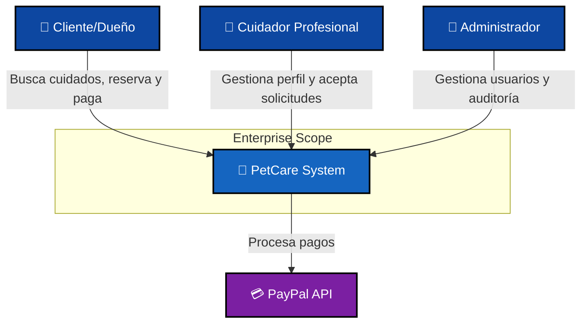
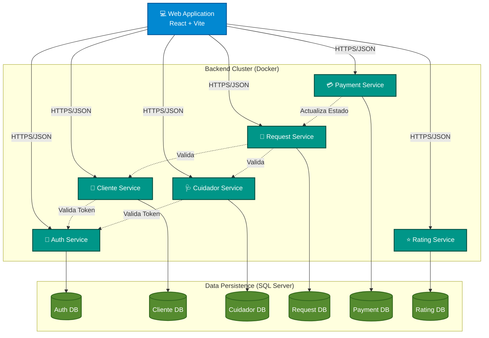

# 🐾 PetCare DSS - Plataforma de Cuidado de Mascotas

Bienvenido a la documentación técnica de **PetCare DSS**, una plataforma distribuida basada en microservicios diseñada para conectar a dueños de mascotas con cuidadores profesionales de manera segura y confiable.

## 🏗️ Arquitectura del Sistema

Esta sección describe la arquitectura de alto nivel utilizando el modelo C4.

### Nivel 1: Contexto del Sistema (C1)
Muestra el "Big Picture": cómo el sistema interactúa con sus usuarios y sistemas externos.

### Nivel 2: Diagrama de Contenedores (C2)
Muestra las aplicaciones desplegables (contenedores Docker) y cómo se comunican en este entorno de microservicios.

## 📚 Documentación de Microservicios

Cada servicio tiene su propia documentación detallada con diagramas C3 (Componentes) y C4 (Código):

- 🔐 [Auth Service](./backend/auth-service/README.md)
- 👤 [Cliente Service](./backend/cliente-service/README.md)
- 🩺 [Cuidador Service](./backend/cuidador-service/README.md)
- 📅 [Request Service](./backend/request-service/README.md)
- 💳 [Payment Service](./backend/payment-service/README.md)
- ⭐ [Rating Service](./backend/calificar-servicie/README.md)
- 🧠 [Shared Kernel](./backend/shared-kernel/README.md)