# PetCare - Auth Service 🔐

Microservicio de autenticación para PetCare con JWT, Identity y búsqueda de usuarios

## Estructura del Proyecto 🏗️

```
PetCare.Auth/
├── Controllers/
│   ├── AuthController.cs          # Endpoints de autenticación ✅
│   ├── AdminController.cs         # Admin y bootstrap ✅
│   └── UsuariosController.cs      # NUEVO: Búsqueda de usuarios
├── Data/
│   └── AuthDbContext.cs           # Contexto de BD con Identity ✅
├── Migrations/
│   ├── README.md                  # Documentación de migraciones ✅
│   └── *.cs                       # Archivos de migración ✅
├── Models/
│   └── Auth/
│       ├── AuthResponse.cs        # Respuesta de autenticación ✅
│       ├── LoginRequest.cs        # DTO para login ✅
│       ├── RegisterRequest.cs     # DTO para registro ✅
│       ├── AdminRegisterRequest.cs # NUEVO: DTO para crear Admins ✅
│       ├── BootstrapAdminRequest.cs # NUEVO: DTO para bootstrap ✅
│       ├── PasswordReset*.cs      # DTOs para reset de contraseña ✅
│       ├── User.cs                # Entidad Usuario extendida ✅
│       ├── UserInfo.cs            # DTO para información de usuario ✅
│       ├── UserRole.cs            # Roles personalizados ✅
│       ├── CuidadorPublicProfile.cs # NUEVO: Perfil público de cuidador
│       ├── ClientePublicProfile.cs # NUEVO: Perfil público de cliente
│       └── ReviewRequest.cs       # NUEVO: DTO para reseñas
├── Services/
│   ├── AuthService.cs             # Lógica de autenticación ✅
│   ├── AdminService.cs            # Admin y bootstrap ✅
│   └── SearchService.cs           # NUEVO: Búsqueda de usuarios
├── Program.cs                     # Configuración principal ✅
├── appsettings.json               # Configuración local ✅
├── appsettings.Docker.json        # Configuración Docker ✅
├── PetCare.Auth.csproj            # Archivo de proyecto ✅
├── PetCare.Auth.http              # Colección de requests ✅
├── QUICK_TEST.http                # NUEVO: Tests rápidos
└── Dockerfile                     # Configuración Docker ✅
```

## Endpoints principales 🌐

### Autenticación (Públicos)

| Método | Endpoint           | Descripción                           | Rol |
|--------|--------------------|---------------------------------------|-----|
| POST   | /api/auth/register | Registro de nuevos usuarios (Cliente/Cuidador) | Público |
| POST   | /api/auth/login    | Inicio de sesión (obtener JWT)        | Público |
| POST   | /api/auth/reset-password | Solicitar reset de contraseña    | Público |
| POST   | /api/auth/confirm-reset | Confirmar reset de contraseña    | Público |
| POST   | /api/auth/change-password | Cambio directo de contraseña     | Autenticado |
| GET    | /api/auth/users    | Lista de usuarios (desarrollo)       | Público |
| GET    | /api/auth/users/{id} | Usuario específico (desarrollo)    | Público |
| GET    | /api/auth/me       | Usuario actual (requiere JWT)        | Autenticado |
| GET    | /api/auth/test     | Endpoint de prueba                    | Público |

### Bootstrap (Público - Solo primer admin)

| Método | Endpoint           | Descripción                           | Rol |
|--------|--------------------|---------------------------------------|-----|
| POST   | /api/admin/bootstrap | Crear PRIMER admin del tenant      | Público (una sola vez) |

### Administración (Protegido)

| Método | Endpoint           | Descripción                           | Rol |
|--------|--------------------|---------------------------------------|-----|
| POST   | /api/admin/register | Crear nuevos Admins (requiere JWT)    | Admin |
| POST   | /api/admin/users | Crear Clientes/Cuidadores/Admins    | Admin |
| GET    | /api/admin/users | Listar usuarios del tenant          | Admin |
| GET    | /api/admin/users/{id} | Detalles de un usuario            | Admin |

### Búsqueda (Públicos / Mixtos)

| Método | Endpoint           | Descripción                           | Rol |
|--------|--------------------|---------------------------------------|-----|
| GET    | /api/usuarios/cuidadores/buscar | Buscar cuidadores por ciudad/especialidades | Público |
| GET    | /api/usuarios/cuidadores/{id} | Ver perfil completo de cuidador | Público |
| GET    | /api/usuarios/clientes/buscar | Buscar clientes por ciudad        | Cuidador |
| GET    | /api/usuarios/clientes/{id} | Ver perfil completo de cliente   | Cuidador |

### Reseñas (Protegido)

| Método | Endpoint           | Descripción                           | Rol |
|--------|--------------------|---------------------------------------|-----|
| POST   | /api/reviews | Crear reseña de cuidador            | Autenticado |
| GET    | /api/reviews/cuidador/{id} | Ver todas las reseñas de un cuidador | Público |

### Desarrollo Local (`appsettings.json`):
```json
{
  "ConnectionStrings": {
    "Default": "Server=localhost,1433;Database=PetCareAuth;User Id=sa;Password=admin1234;TrustServerCertificate=true;"
  },
  "Jwt": {
    "Key": "TuClaveSecretaDe64CaracteresParaJWTTokenSeguro2024",
    "Issuer": "PetCare.Auth",
    "Audience": "PetCare.Client",
    "ExpireDays": 7
  }
}
```

### Docker (`appsettings.Docker.json`):
```json
{
  "ConnectionStrings": {
    "Default": "Server=db;Database=PetCareAuth;User Id=sa;Password=YourStrong@Passw0rd;TrustServerCertificate=true;"
  },
  "Jwt": {
    "Key": "TuClaveSecretaDe64CaracteresParaJWTTokenSeguro2024",
    "Issuer": "PetCare.Auth",
    "Audience": "PetCare.Client",
    "ExpireDays": 7
  }
}
```

## Estado de Requisitos Funcionales de Autenticación 📋

### Requisitos de AUTH Implementados ✅

| ID | Tipo | Descripción | Status | CC | Documento |
|----|------|-------------|--------|----|----|
| **RF-01** | Req. Funcional | Autenticación JWT universal | ✅ COMPLETO | FIA_UID.2, FIA_UAU.2 | [Ver Auth](PetCare.Auth/Services/AuthService.cs#L178) |
| **RF-02** | Req. Funcional | Bloqueo de cuenta tras 5 intentos fallidos (30 min) | ✅ IMPLEMENTADO | FIA_AFL.1 | [RF-02_ESPECIFICACION_COMPLETA.md](RF-02_ESPECIFICACION_COMPLETA.md) |
| **RF-03** | Req. Funcional | Política de contraseñas fuertes (mín 8 chars, alfanumérico) | ⏳ PENDIENTE | FIA_SOS.1 | Planeado Sprint 2 |
| **RF-04** | Req. Funcional | Mensajes de error genéricos (anti-enumeración) | ✅ ESPECIFICADO | FIA_UAU.7 | [RF-02_ESPECIFICACION_COMPLETA.md#rf-028-mensaje-genérico](RF-02_ESPECIFICACION_COMPLETA.md#rf-028-mensaje-genérico) |
| **RF-05** | Req. Funcional | Atributos de sesión en JWT (sub, role, tenant, mfa) | ✅ IMPLEMENTADO | FIA_ATD.1, FIA_USB.1 | [GenerarTokenJWT()](PetCare.Auth/Services/AuthService.cs#L200) |
| **RF-10** | Req. Funcional | Hashing seguro con BCrypt/Argon2 | ✅ HEREDADO | FCS_COP.1 | ASP.NET Identity (default) |

### Requisitos No Funcionales de AUTH 🔒

| ID | Tipo | Descripción | Status | CC | Documento |
|----|------|-------------|--------|----|----|
| **RNF-01** | No Funcional | TLS 1.2+ obligatorio en comunicaciones | ✅ CONFIGURADO | FDP_UCT.1 | Program.cs HTTPS |
| **RNF-02** | No Funcional | Cifrado en reposo + secretos en Vault | ⏳ PENDIENTE (Producción) | FDP_ITT.2 | Implementar en Prod |

### Historias de Usuario (AUTH-related) 👤

| ID | Descripción | Status | CC | Sprint |
|----|-------------|--------|----|----|
| **HU-03** | MFA para admins en operaciones críticas | 📋 ESPECIFICADA | FIA_UAU.5 | Sprint 4 |

---

## Características Implementadas ✨

### Core Authentication
- ✅ **Autenticación JWT** con tokens seguros (RF-01)
- ✅ **Registro de usuarios** con validación de roles (RF-01)
- ✅ **Login con credenciales** y validación de tenant (RF-01)
- ✅ **Bloqueo de cuenta** tras 5 intentos fallidos - 30 min (RF-02) 🆕
- ✅ **Auto-desbloqueo** automático (RF-02) 🆕
- ✅ **Reset de contraseña** por email (simulado)
- ✅ **Cambio de contraseña** directo
- ✅ **Mensajes de error genéricos** para anti-enumeration (RF-04)

### JWT & Security
- ✅ **JWT con claims** (sub, email, name, role, tenant, mfa) (RF-05)
- ✅ **Validación de tenant** en cada operación (RF-01)
- ✅ **Validación de rol** restrictiva en registro (RF-01)
- ✅ **Hashing seguro** de contraseñas (RF-10)
- ✅ **HTTPS/TLS 1.2+** obligatorio (RNF-01)

### Roles & Multi-tenancy
- ✅ **Roles de usuario** (Admin, Cliente, Cuidador) (RF-01)
- ✅ **Multi-tenancy** con IdentificadorArrendador (RF-01)
- ✅ **Bootstrap de admin** one-time con validación (RF-01)
- ✅ **Segregación por tenant** en queries (RF-01)

### Infrastructure
- ✅ **Swagger/OpenAPI** para documentación
- ✅ **Base de datos automática** en desarrollo
- ✅ **Migraciones automáticas** con EF Core
- ✅ **Carpeta de migraciones** con documentación
- ✅ **Configuración simple** en appsettings.json
- ✅ **Docker ready** con appsettings.Docker.json
- ✅ **CORS configurado** para desarrollo
- ✅ **Logging detallado** para debugging
- ✅ **Endpoints de prueba** para verificación

## Uso 🚀

### 🖥️ Desarrollo Local

#### Prerrequisitos:
- .NET 8.0 SDK
- SQL Server local en puerto 1433
- Usuario SA con contraseña (pon la contraseña de tu SQL Server local aquí)

#### Pasos:
```bash
cd auth-service/PetCare.Auth
dotnet run
```
> ℹ️ Al ejecutar `dotnet run` por primera vez, .NET restaurará automáticamente los paquetes NuGet necesarios para ese proyecto. Si prefieres, puedes ejecutar `dotnet restore` manualmente antes de `dotnet run`.

#### Verificación:
- Los logs mostrarán: `🔧 Entorno detectado: Development`
- Connection string: `Server: localhost,1433`
- Migraciones se aplicarán automáticamente

### 🐳 Docker

#### Prerrequisitos:
1. **Docker Desktop** instalado y corriendo
2. **Docker Compose** disponible

#### Pasos:
```bash
# 1. Ir al directorio raíz del proyecto
cd PetCareSolution

# 2. Ejecutar con Docker Compose
docker-compose up -d

# 3. Verificar que los contenedores estén corriendo
docker-compose ps

# 4. Ver logs en tiempo real
docker-compose logs -f petcare-auth

# 5. Acceder a Swagger
# http://localhost:5001/swagger
```

#### Verificación:
- Los logs mostrarán: `🔧 Entorno detectado: Docker`
- Connection string: `Server: db`
- Migraciones se aplicarán automáticamente

### 🔧 Comandos Útiles

#### Desarrollo Local:
```bash
# Aplicar migraciones manualmente
dotnet ef database update

# Crear nueva migración
dotnet ef migrations add NombreMigracion

# Ver migraciones aplicadas
dotnet ef migrations list
```

#### Docker:
```bash
# Reconstruir imagen
docker-compose build --no-cache

# Ver logs específicos
docker-compose logs petcare-auth

# Entrar al contenedor
docker-compose exec petcare-auth bash

# Detener servicios
docker-compose down

# Detener y eliminar volúmenes
docker-compose down -v
```

## Ejemplos de Uso 📝

### Registro de Cliente
```json
POST /api/auth/register
{
  "email": "cliente@ejemplo.com",
  "password": "Password123!",
  "name": "Cliente Ejemplo",
  "role": "Cliente"
}
```

### Registro de Cuidador
```json
POST /api/auth/register
{
  "email": "cuidador@ejemplo.com",
  "password": "Password123!",
  "name": "Cuidador Ejemplo",
  "role": "Cuidador"
}
```

### Login
```json
POST /api/auth/login
{
  "email": "cliente@ejemplo.com",
  "password": "Password123!"
}
```

### Obtener Usuarios (Desarrollo)
```bash
GET /api/auth/users
```

### Endpoint de Prueba
```bash
GET /api/auth/test
```

## Roles de Usuario 👥

### Roles Disponibles
- **Cliente** - Usuarios que solicitan servicios de cuidado de mascotas
- **Cuidador** - Usuarios que ofrecen servicios de cuidado de mascotas
- **Admin** - Administradores del sistema (creado automáticamente)

### Asignación de Roles
- Los roles se asignan durante el registro
- Solo se permiten roles "Cliente" o "Cuidador" en el registro
- El rol se incluye en el JWT token para autorización
- Los roles se crean automáticamente en la base de datos

## Seguridad 🔒

- Contraseñas hasheadas con Identity
- Tokens JWT con expiración configurable
- Validación de email único
- Requisitos de contraseña segura
- Tokens de reset con expiración
- Validación de roles en el registro
- CORS configurado para desarrollo

## Dependencias 📦

- Microsoft.AspNetCore.Authentication.JwtBearer
- Microsoft.AspNetCore.Identity.EntityFrameworkCore
- Microsoft.EntityFrameworkCore.SqlServer
- System.IdentityModel.Tokens.Jwt
- Swashbuckle.AspNetCore

## Troubleshooting 🔧

### Problemas Comunes:

#### 1. Error de Conexión a Base de Datos
```bash
# Verificar SQL Server local
sqlcmd -S localhost,1433 -U sa -P admin1234 -Q "SELECT 1"

# Verificar puerto
netstat -an | findstr 1433
```

#### 2. Swagger No Funciona
```bash
# Verificar que la aplicación esté corriendo
curl http://localhost:5042/api/auth/test

# Verificar logs
docker-compose logs petcare-auth
```

#### 3. Migraciones No Se Aplican
```bash
# Aplicar manualmente
dotnet ef database update

# Verificar base de datos
sqlcmd -S localhost,1433 -U sa -P admin1234 -d PetCareAuth -Q "SELECT * FROM __EFMigrationsHistory"
```

#### 4. Contenedor Docker Se Cae
```bash
# Ver logs detallados
docker-compose logs -f petcare-auth

# Reconstruir sin cache
docker-compose build --no-cache petcare-auth
```

## Diagrama de Flujo 🔄

```mermaid
sequenceDiagram
    Cliente->>+AuthService: POST /register
    AuthService->>+DB: Crear usuario
    DB-->>-AuthService: Usuario creado
    AuthService-->>-Cliente: JWT
    
    Cliente->>+AuthService: POST /login
    AuthService->>+DB: Validar credenciales
    DB-->>-AuthService: Usuario válido
    AuthService-->>-Cliente: JWT
    
    Cliente->>+AuthService: GET /users
    AuthService->>+DB: Obtener usuarios
    DB-->>-AuthService: Lista de usuarios
    AuthService-->>-Cliente: JSON con usuarios
```

