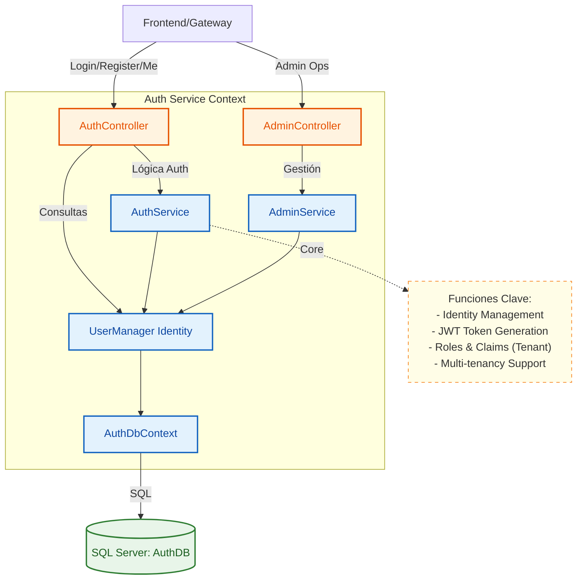
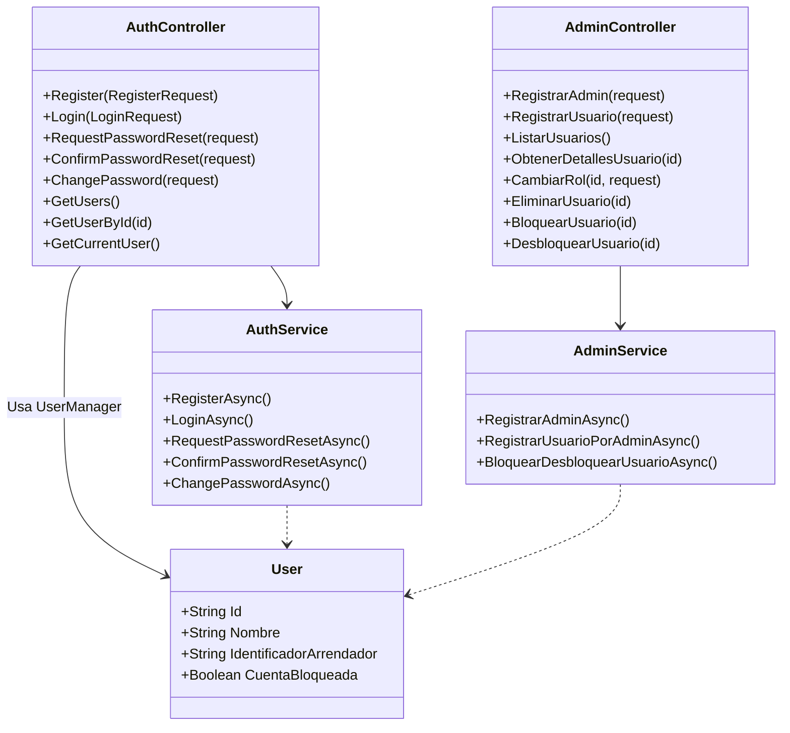

# Servicio de Autenticación (Auth Service)

Es el guardián de la seguridad en PetCare. Gestiona el registro, inicio de sesión (JWT) y la administración de usuarios y roles. También expone endpoints para que otros servicios validen identidades y obtengan información de usuarios.

## Arquitectura C4

### Nivel 3: Diagrama de Componentes

### Nivel 4: Diagrama de Código

## Funcionalidades
- **Autenticación JWT**: Generación y validación de tokens seguros.
- **Gestión de Roles**: Soporte para roles de Administrador, Cliente y Cuidador.
- **Administración**: Endpoints para ver lista de usuarios y gestionar bloqueos de acceso.
- **Integración entre Servicios**: Provee datos de usuario (email, teléfono, bloqueo) a `Cliente-Service` y `Cuidador-Service`.

## Tecnologías
- **Framework**: .NET 8 (ASP.NET Core Identity)
- **Base de Datos**: SQL Server
- **Seguridad**: JWT Bearer Authentication
