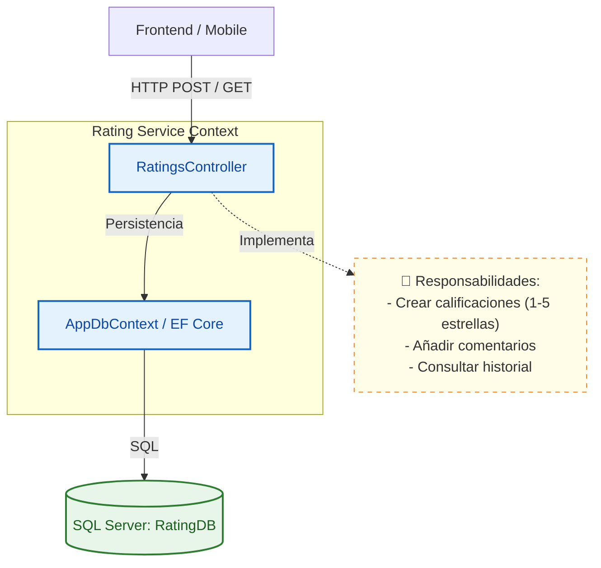
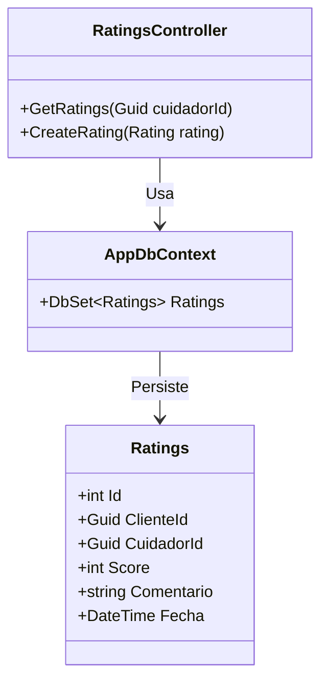

# ⭐ Servicio de Calificaciones (Rating Service)

Este microservicio gestiona las valoraciones y reseñas que los dueños de mascotas dejan a los cuidadores. Es fundamental para el sistema de confianza y reputación de la plataforma.

## 🏗️ Arquitectura C4

### Nivel 3: Diagrama de Componentes

### Nivel 4: Diagrama de Código

## 🚀 Funcionalidades
- **Calificar**: Permite a un cliente calificar a un cuidador con un puntaje y comentario.
- **Historial**: Permite recuperar todas las calificaciones asociadas a un cuidador específico.

## 🛠️ Tecnologías
- **Framework**: .NET 8
- **Base de Datos**: SQL Server
- **ORM**: Entity Framework Core
