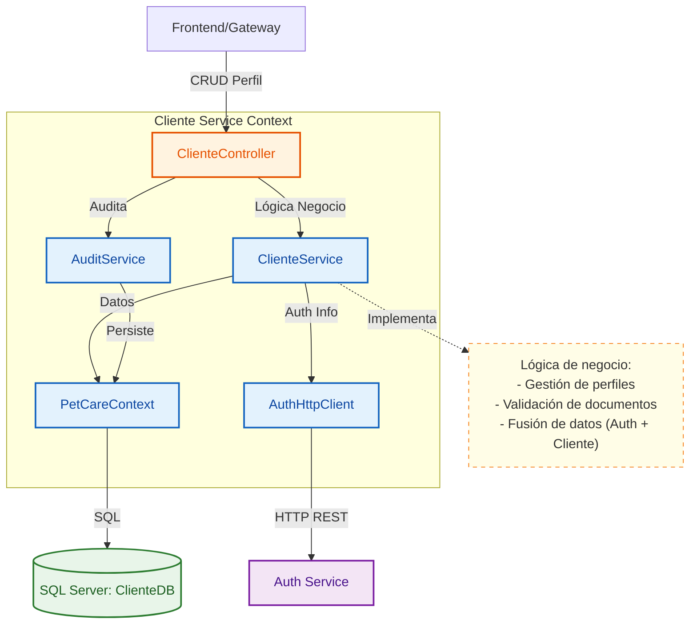
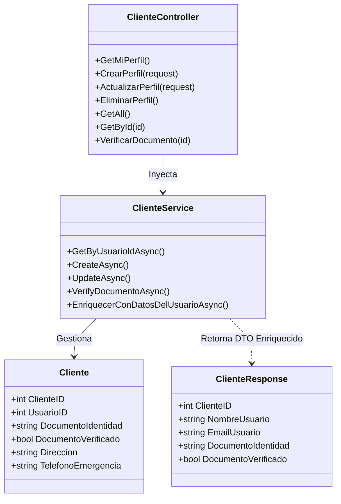

# Servicio de Clientes (Cliente Service)

Este microservicio es el responsable de gestionar toda la información relacionada con los dueños de mascotas (clientes) dentro de la plataforma PetCare. Maneja perfiles, direcciones, validación de documentos y la integración con el servicio de identidad.

## Arquitectura C4

A continuación se presentan los diagramas de arquitectura para entender la estructura interna del servicio.

### Nivel 3: Diagrama de Componentes
Muestra cómo los componentes internos del servicio interactúan entre sí y con sistemas externos.

### Nivel 4: Diagrama de Código (Clases Principales)
Detalla la implementación de las clases clave y sus relaciones.

## Funcionalidades Principales

1.  **Gestión de Perfil**: Creación y edición de información personal del cliente.
2.  **Verificación de Identidad**: Flujo para marcar documentos como verificados por un administrador.
3.  **Enriquecimiento de Datos**: Obtiene datos sensibles (email, roles, estado de bloqueo) directamente del `Auth Service` para no duplicar información crítica.
4.  **Integración Admin**: Endpoints específicos para que el dashboard de administración gestione a los usuarios.

## Tecnologías

- **Framework**: .NET 8 (ASP.NET Core Web API)
- **Base de Datos**: SQL Server
- **ORM**: Entity Framework Core
- **Comunicación**: REST, HttpClient (comunicación síncrona con Auth)
- **Contenerización**: Docker

## Notas de Desarrollo

- El campo `UsuarioID` vincula este registro con el usuario en `Auth Service`.
- La propiedad `CuentaBloqueada` no se persiste aquí, se consulta en tiempo real al `Auth Service`.
