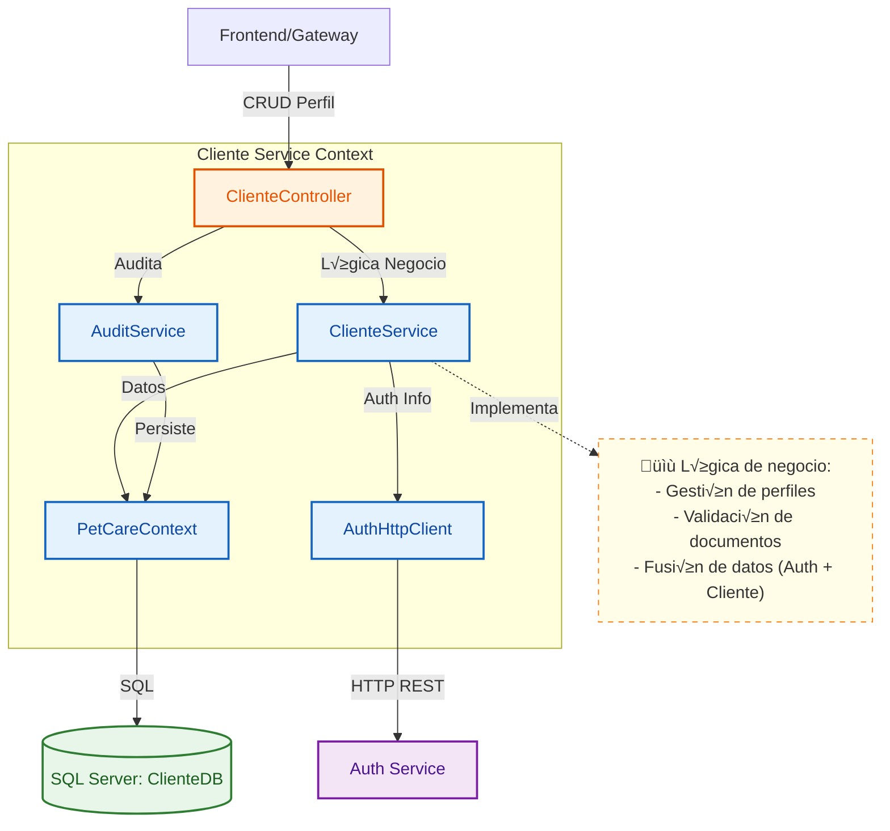
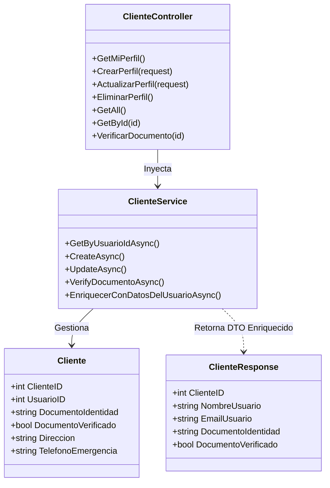

# 👤 Servicio de Clientes (Cliente Service)

Este microservicio es el responsable de gestionar toda la información relacionada con los dueños de mascotas (clientes) dentro de la plataforma PetCare. Maneja perfiles, direcciones, validación de documentos y la integración con el servicio de identidad.

## 🏗️ Arquitectura C4

A continuación se presentan los diagramas de arquitectura para entender la estructura interna del servicio.

### Nivel 3: Diagrama de Componentes
Muestra cómo los componentes internos del servicio interactúan entre sí y con sistemas externos.

```mermaid
graph TD
    %% Nodos externos
    User[Frontend/Gateway]
    DB[(SQL Server: ClienteDB)]
    AuthService[Auth Service]
    
    subgraph "Cliente Service Context"
        Controller[ClienteController]
        Service[ClienteService]
        Repo[PetCareContext]
        AuthClient[AuthHttpClient]
        Audit[AuditService]
    end

    %% Relaciones
    User -->|CRUD Perfil| Controller
    Controller -->|Lógica Negocio| Service
    Service -->|Datos| Repo
    Service -->|Auth Info| AuthClient
    
    Controller -- Audita --> Audit
    Audit -- Persiste --> Repo
    
    Repo -->|SQL| DB
    AuthClient -->|"HTTP REST"| AuthService

    %% Nota como nodo
    ServiceNote["📝 Lógica de negocio:<br/>- Gestión de perfiles<br/>- Validación de documentos<br/>- Fusión de datos (Auth + Cliente)"]
    Service -.->|Implementa| ServiceNote

    %% Estilos
    classDef component fill:#e3f2fd,stroke:#1565c0,stroke-width:2px,color:#0d47a1
    classDef db fill:#e8f5e9,stroke:#2e7d32,stroke-width:2px,color:#1b5e20
    classDef external fill:#f3e5f5,stroke:#7b1fa2,stroke-width:2px,color:#4a148c
    classDef api fill:#fff3e0,stroke:#e65100,stroke-width:2px,color:#e65100
    classDef note fill:#fffde7,stroke:#f57f17,stroke-width:1px,stroke-dasharray: 5 5,color:#333

    class Service,Repo,AuthClient,Audit component
    class DB db
    class AuthService external
    class Controller api
    class ServiceNote note
```

### Nivel 4: Diagrama de Código (Clases Principales)
Detalla la implementación de las clases clave y sus relaciones.

```mermaid
classDiagram
    %% Estilos
    classDef controller fill:#ffe0b2,stroke:#f57c00,stroke-width:1px
    classDef service fill:#bbdefb,stroke:#1976d2,stroke-width:1px
    classDef model fill:#c8e6c9,stroke:#388e3c,stroke-width:1px

    class ClienteController:::controller {
        +GetMiPerfil()
        +CrearPerfil(request)
        +ActualizarPerfil(request)
        +EliminarPerfil()
        +GetAll()
        +GetById(id)
        +VerificarDocumento(id)
    }

    class ClienteService:::service {
        +GetByUsuarioIdAsync()
        +CreateAsync()
        +UpdateAsync()
        +VerifyDocumentoAsync()
        +EnriquecerConDatosDelUsuarioAsync()
    }

    class Cliente:::model {
        +int ClienteID
        +int UsuarioID
        +string DocumentoIdentidad
        +bool DocumentoVerificado
        +string Direccion
        +string TelefonoEmergencia
    }

    class ClienteResponse:::model {
        +int ClienteID
        +string NombreUsuario
        +string EmailUsuario
        +string DocumentoIdentidad
        +bool DocumentoVerificado
    }

    ClienteController --> ClienteService : Inyecta
    ClienteService --> Cliente : Gestiona
    ClienteService ..> ClienteResponse : Retorna DTO Enriquecido
```

## üöÄ Funcionalidades Principales

1.  **Gestión de Perfil**: Creación y edición de información personal del cliente.
2.  **Verificación de Identidad**: Flujo para marcar documentos como verificados por un administrador.
3.  **Enriquecimiento de Datos**: Obtiene datos sensibles (email, roles, estado de bloqueo) directamente del `Auth Service` para no duplicar información crítica.
4.  **Integración Admin**: Endpoints específicos para que el dashboard de administración gestione a los usuarios.

## 🛠️ Tecnologías

- **Framework**: .NET 8 (ASP.NET Core Web API)
- **Base de Datos**: SQL Server
- **ORM**: Entity Framework Core
- **Comunicación**: REST, HttpClient (comunicación síncrona con Auth)
- **Contenerización**: Docker

## üìù Notas de Desarrollo

- El campo `UsuarioID` vincula este registro con el usuario en `Auth Service`.
- La propiedad `CuentaBloqueada` no se persiste aquí, se consulta en tiempo real al `Auth Service`.
