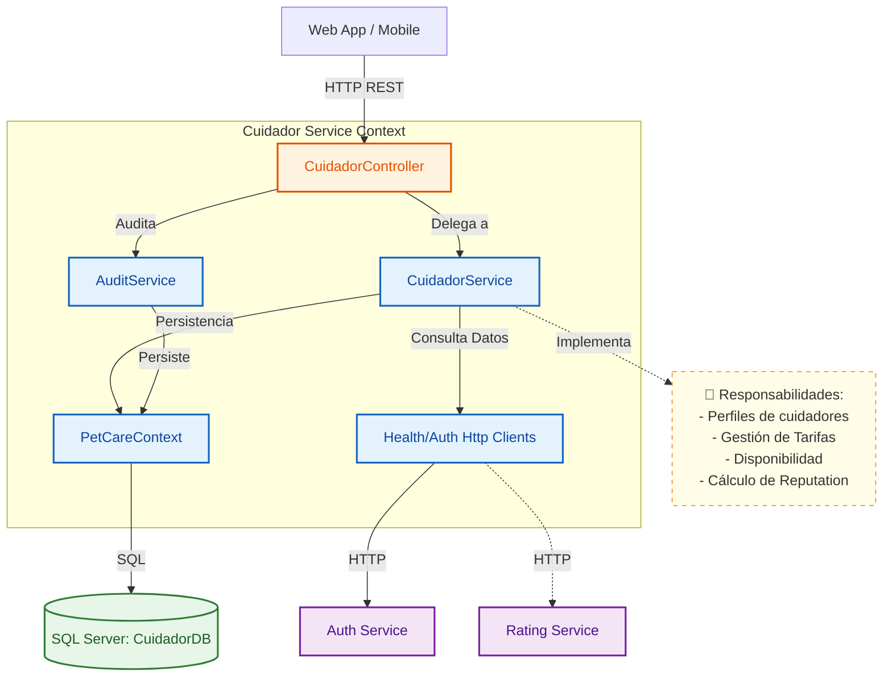
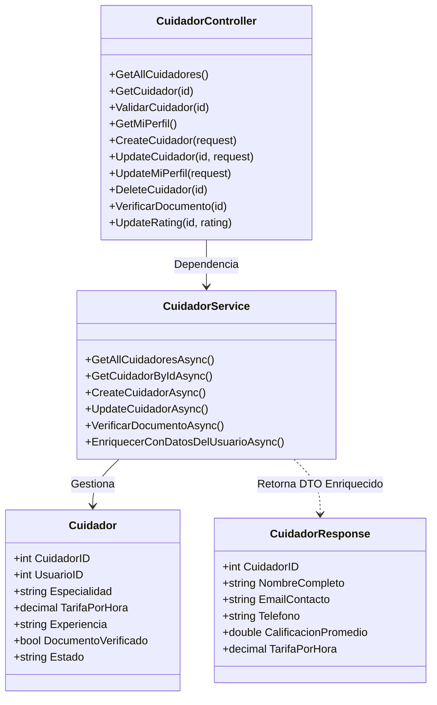

# 🐾 Servicio de Cuidadores (Cuidador Service)

Este microservicio gestiona la información de los **Cuidadores** (Caregivers) en la plataforma PetCare. Es el núcleo de la oferta de servicios, manejando perfiles profesionales, tarifas, especialidades y la reputación de los cuidadores.

## 🏗️ Arquitectura C4

A continuación se presentan los diagramas de arquitectura para entender la estructura interna del servicio.

### Nivel 3: Diagrama de Componentes
Muestra las interacciones del servicio con bases de datos y servicios externos (Auth y Rating).

### Nivel 4: Diagrama de Código (Clases Principales)
Detalla la lógica interna para la gestión de cuidadores y la agregación de datos.

## 🚀 Funcionalidades Principales

1.  **Perfil Profesional**: Gestión de biografía, especialidades (perros, gatos, cuidados especiales) y experiencia.
2.  **Tarifas y Servicios**: Configuración del costo por hora de servicio.
3.  **Estado y Verificación**: Control de validación de documentos y estado de la cuenta (activa/bloqueada).
4.  **Agregación de Información**: Combina datos de `Auth` (identidad) y `Rating` (reputación) para presentar un perfil completo al cliente final.

## 🛠️ Tecnologías

- **Framework**: .NET 8 (ASP.NET Core Web API)
- **Base de Datos**: SQL Server
- **ORM**: Entity Framework Core
- **Comunicación**: REST, HttpClient
- **Estrategia de Carga**: `Task.WhenAll` para carga paralela eficiente de datos externos (Auth/Rating).

## 📝 Notas de Desarrollo

- Este servicio actúa como un "agregador" de información para mostrar las tarjetas de cuidadores en el frontend, orquestando llamadas a múltiples fuentes de datos.
