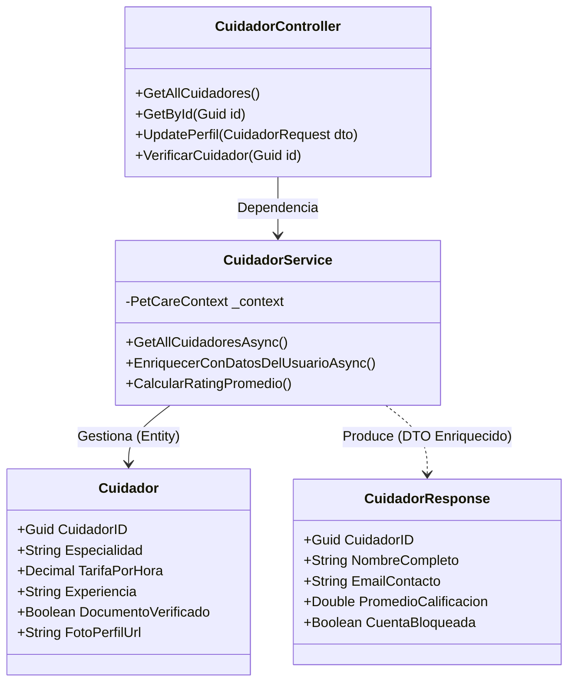

# 🐾 Servicio de Cuidadores (Cuidador Service)

Este microservicio gestiona la información de los **Cuidadores** (Caregivers) en la plataforma PetCare. Es el núcleo de la oferta de servicios, manejando perfiles profesionales, tarifas, especialidades y la reputación de los cuidadores.

## 🏗️ Arquitectura C4

A continuación se presentan los diagramas de arquitectura para entender la estructura interna del servicio.

### Nivel 3: Diagrama de Componentes
Muestra las interacciones del servicio con bases de datos y servicios externos (Auth y Rating).

```mermaid
graph TD
    %% Nodos externos
    User[Web App / Mobile]
    DB[(SQL Server: CuidadorDB)]
    AuthService[Auth Service]
    RatingService[Rating Service]

    subgraph "Cuidador Service Context"
        Controller[CuidadorController]
        Service[CuidadorService]
        Repo[PetCareContext / EF Core]
        ApiClients[Health/Auth Http Clients]
    end

    %% Relaciones
    User -->|HTTP REST| Controller
    Controller -->|Delega a| Service
    Service -->|Persistencia| Repo
    Service -->|Consulta Datos| ApiClients

    Repo -->|SQL| DB
    ApiClients -->|HTTP| AuthService
    ApiClients -.->|"HTTP (Opcional)"| RatingService

    %% Nota como nodo
    ServiceNote["📝 Responsabilidades:<br/>- Perfiles de cuidadores<br/>- Gestión de Tarifas<br/>- Disponibilidad<br/>- Cálculo de Reputation"]
    Service -.->|Implementa| ServiceNote

    %% Estilos
    classDef component fill:#e3f2fd,stroke:#1565c0,stroke-width:2px,color:#0d47a1
    classDef db fill:#e8f5e9,stroke:#2e7d32,stroke-width:2px,color:#1b5e20
    classDef external fill:#f3e5f5,stroke:#7b1fa2,stroke-width:2px,color:#4a148c
    classDef api fill:#fff3e0,stroke:#e65100,stroke-width:2px,color:#e65100
    classDef note fill:#fffde7,stroke:#f57f17,stroke-width:1px,stroke-dasharray: 5 5,color:#333

    class Service,Repo,ApiClients component
    class DB db
    class AuthService,RatingService external
    class Controller api
    class ServiceNote note
```

### Nivel 4: Diagrama de Código (Clases Principales)
Detalla la lógica interna para la gestión de cuidadores y la agregación de datos.

## 🚀 Funcionalidades Principales

1.  **Perfil Profesional**: Gestión de biografía, especialidades (perros, gatos, cuidados especiales) y experiencia.
2.  **Tarifas y Servicios**: Configuración del costo por hora de servicio.
3.  **Estado y Verificación**: Control de validación de documentos y estado de la cuenta (activa/bloqueada).
4.  **Agregación de Información**: Combina datos de `Auth` (identidad) y `Rating` (reputación) para presentar un perfil completo al cliente final.

## 🛠️ Tecnologías

- **Framework**: .NET 8 (ASP.NET Core Web API)
- **Base de Datos**: SQL Server
- **ORM**: Entity Framework Core
- **Comunicación**: REST, HttpClient
- **Estrategia de Carga**: `Task.WhenAll` para carga paralela eficiente de datos externos (Auth/Rating).

## 📝 Notas de Desarrollo

- Este servicio actúa como un "agregador" de información para mostrar las tarjetas de cuidadores en el frontend, orquestando llamadas a múltiples fuentes de datos.
