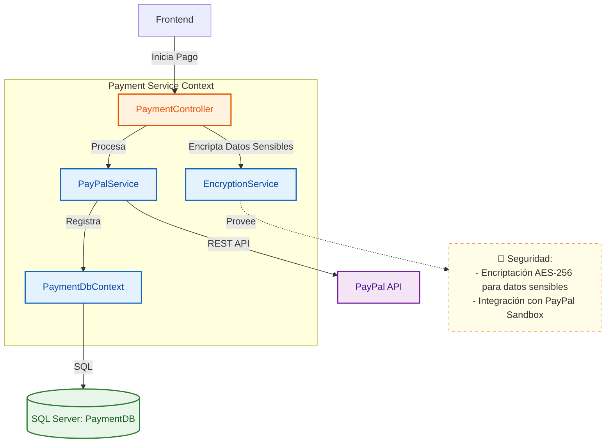
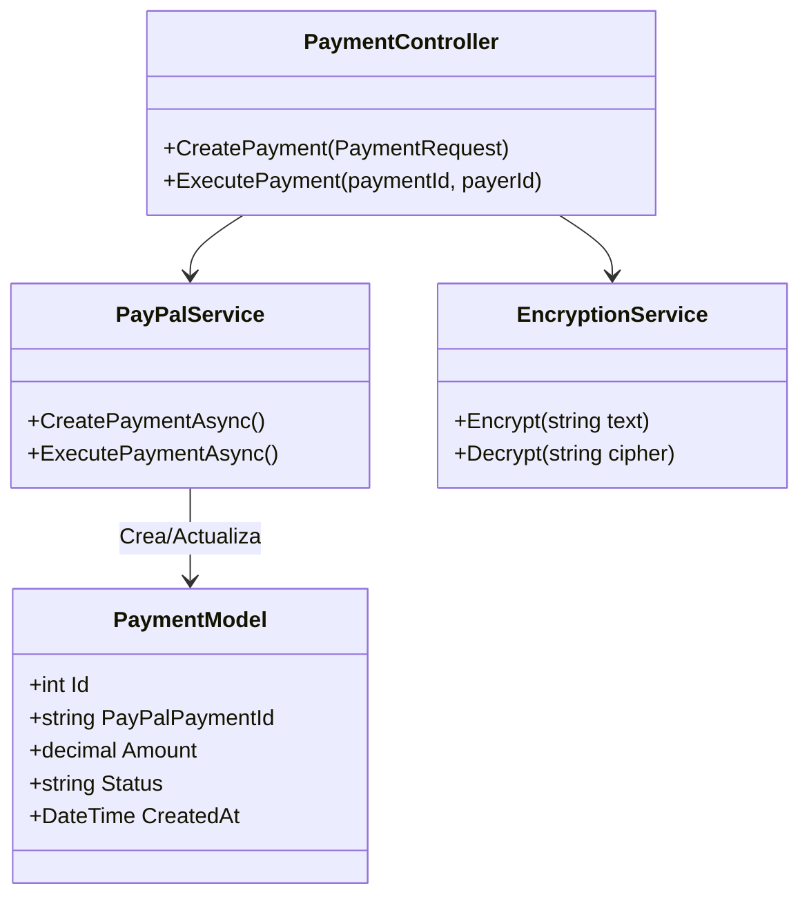

# 💳 Servicio de Pagos (Payment Service)

Gestiona las transacciones financieras dentro de la plataforma, integrándose con pasarelas de pago externas (simulado vía PayPal Sandbox) y manteniendo un registro seguro y auditable de los pagos.

## 🏗️ Arquitectura C4

### Nivel 3: Diagrama de Componentes

### Nivel 4: Diagrama de Código

## 🚀 Funcionalidades
- **Creación de Pagos**: Genera enlaces de pago redireccionando a PayPal.
- **Ejecución de Pagos**: Finaliza la transacción una vez aprobada por el usuario.
- **Seguridad**: Los detalles sensibles se almacenan encriptados en la base de datos.
- **Auditoría**: Historial completo de transacciones.

## 🛠️ Tecnologías
- **Framework**: .NET 8
- **Base de Datos**: SQL Server
- **Pasarela**: PayPal SDK / REST API
- **Seguridad**: AES Encryption (System.Security.Cryptography)
