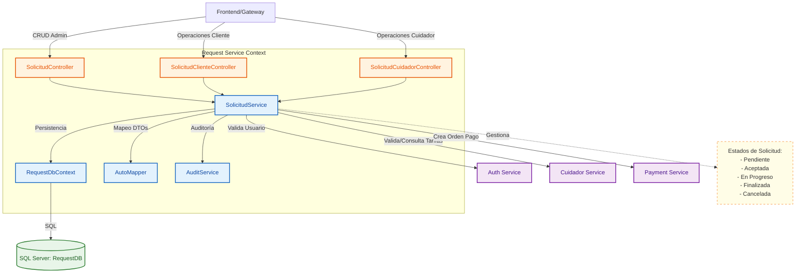
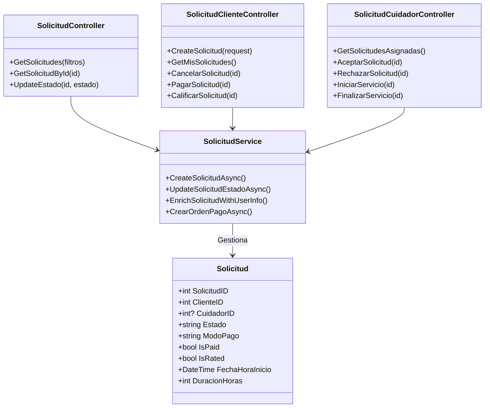

# Servicio de Solicitudes (Request Service)

El corazón operativo de la plataforma. Gestiona el ciclo de vida completo de una solicitud de cuidado, desde que el cliente la crea, el cuidador la acepta/rechaza, hasta que se marca como completada y pagada.

## Arquitectura C4

### Nivel 3: Diagrama de Componentes

### Nivel 4: Diagrama de Código

## Funcionalidades
- **Gestión de Citas**: Creación, edición y cancelación de solicitudes de servicio.
- **Flujo de Estados**: Máquina de estados robusta para transiciones válidas (ej. no se puede pagar una solicitud rechazada).
- **Seguimiento de Pagos**: Registra si una solicitud ha sido pagada (conectando lógicamente con Payment Service).

## Tecnologías
- **Framework**: .NET 8
- **Base de Datos**: SQL Server
- **Mapeo**: AutoMapper
