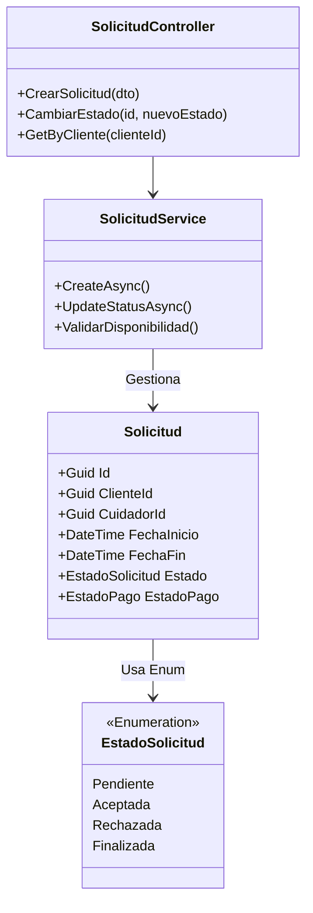

# 📅 Servicio de Solicitudes (Request Service)

El corazón operativo de la plataforma. Gestiona el ciclo de vida completo de una solicitud de cuidado, desde que el cliente la crea, el cuidador la acepta/rechaza, hasta que se marca como completada y pagada.

## 🏗️ Arquitectura C4

### Nivel 3: Diagrama de Componentes

```mermaid
graph TD
    %% Nodos externos
    User[Frontend]
    DB[(SQL Server: RequestDB)]
    RabbitMQ[Event Bus]

    subgraph "Request Service Context"
        SolCtrl[SolicitudController]
        Service[SolicitudService]
        Repo[RequestDbContext]
        Mapper[AutoMapper]
    end

    %% Relaciones
    User -->|CRUD Solicitudes| SolCtrl
    SolCtrl -->|Lógica Negocio| Service
    Service -->|Mapeo DTOs| Mapper
    Service -->|Persistencia| Repo
    
    Repo -->|SQL| DB
    Service -.->|Publica Eventos (Futuro)| RabbitMQ

    %% Nota
    ServiceNote["📝 Estados de Solicitud:<br/>- Pendiente<br/>- Aceptada<br/>- En Progreso<br/>- Finalizada<br/>- Cancelada"]
    Service -.->|Gestiona| ServiceNote

    %% Estilos
    classDef component fill:#e3f2fd,stroke:#1565c0,stroke-width:2px,color:#0d47a1
    classDef db fill:#e8f5e9,stroke:#2e7d32,stroke-width:2px,color:#1b5e20
    classDef external fill:#f3e5f5,stroke:#7b1fa2,stroke-width:2px,color:#4a148c
    classDef api fill:#fff3e0,stroke:#e65100,stroke-width:2px,color:#e65100
    classDef note fill:#fffde7,stroke:#f57f17,stroke-width:1px,stroke-dasharray: 5 5,color:#333

    class Service,Repo,Mapper component
    class SolCtrl api
    class DB db
    class RabbitMQ external
    class ServiceNote note
```

### Nivel 4: Diagrama de Código



## 🚀 Funcionalidades
- **Gestión de Citas**: Creación, edición y cancelación de solicitudes de servicio.
- **Flujo de Estados**: Máquina de estados robusta para transiciones válidas (ej. no se puede pagar una solicitud rechazada).
- **Seguimiento de Pagos**: Registra si una solicitud ha sido pagada (conectando lógicamente con Payment Service).

## 🛠️ Tecnologías
- **Framework**: .NET 8
- **Base de Datos**: SQL Server
- **Mapeo**: AutoMapper
