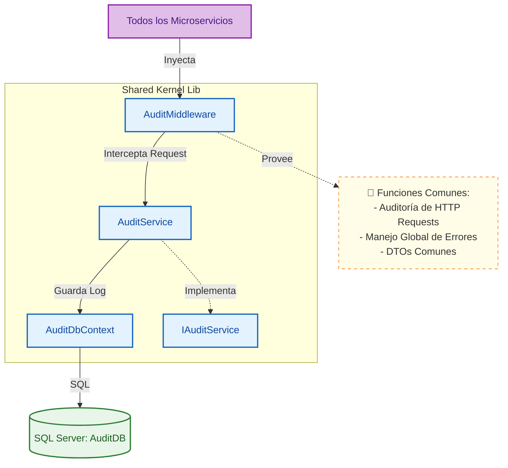

# 🧠 Shared Kernel (Núcleo Compartido)

Biblioteca de clases y componentes transversales utilizados por múltiples microservicios. Centraliza lógica común como auditoría, modelos base, middlewares y excepciones personalizadas para asegurar consistencia en todo el sistema.

## 🏗️ Arquitectura C4

### Nivel 3: Diagrama de Componentes



### Nivel 4: Diagrama de Código (Auditoría)

```mermaid
classDiagram
    %% Estilos
    classDef service fill:#bbdefb,stroke:#1976d2,stroke-width:1px
    classDef middleware fill:#ffe0b2,stroke:#f57c00,stroke-width:1px
    classDef model fill:#c8e6c9,stroke:#388e3c,stroke-width:1px

    class AuditMiddleware:::middleware {
        +InvokeAsync(HttpContext context)
    }

    class AuditService:::service {
        +LogAsync(AuditEntry entry)
    }

    class AuditEntry:::model {
        +Guid Id
        +string Usuario
        +string Accion
        +string Endpoint
        +DateTime Fecha
        +string Detalles
    }

    interface IAuditService {
        +LogAsync(AuditEntry entry)
    }

    AuditMiddleware --> IAuditService : Usa
    AuditService ..|> IAuditService : Implementa
    AuditService --> AuditEntry : Persiste
```

## 🚀 Componentes Principales
- **Auditoría Centralizada**: Middleware que captura automáticamente quién hizo qué en cada endpoint de la API.
- **Modelos Base**: Entidades comunes para evitar duplicación de código.
- **Configuraciones**: Helpers para inyección de dependencias y configuración de JWT.

## 🛠️ Tecnologías
- **Tipo**: Class Library (.NET 8)
- **Base de Datos**: SQL Server (Contexto compartido solo para auditoría)
