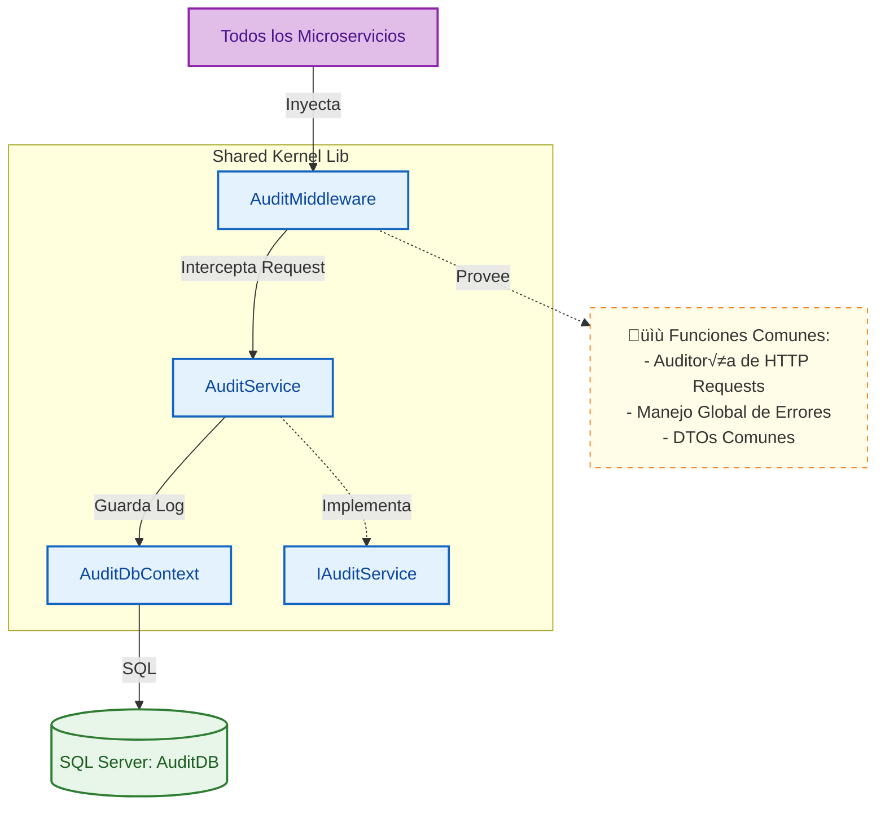
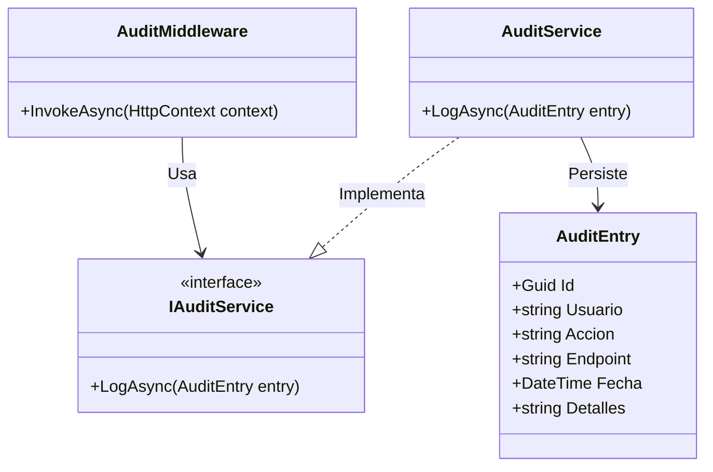

# 🧠 Shared Kernel (Núcleo Compartido)

Biblioteca de clases y componentes transversales utilizados por múltiples microservicios. Centraliza lógica común como auditoría, modelos base, middlewares y excepciones personalizadas para asegurar consistencia en todo el sistema.

## 🏗️ Arquitectura C4

### Nivel 3: Diagrama de Componentes

```mermaid
graph TD
    %% Nodos externos
    Microservices[Todos los Microservicios]
    DB[(SQL Server: AuditDB)]

    subgraph "Shared Kernel Lib"
        Middleware[AuditMiddleware]
        Service[AuditService]
        Repo[AuditDbContext]
        Interfaces[IAuditService]
    end

    %% Relaciones
    Microservices -->|Inyecta| Middleware
    Middleware -->|Intercepta Request| Service
    Service -.->|Implementa| Interfaces
    Service -->|Guarda Log| Repo
    Repo -->|SQL| DB

    %% Nota
    ServiceNote["📝 Funciones Comunes:<br/>- Auditoría de HTTP Requests<br/>- Manejo Global de Errores<br/>- DTOs Comunes"]
    Middleware -.->|Provee| ServiceNote

    %% Estilos
    classDef component fill:#e3f2fd,stroke:#1565c0,stroke-width:2px,color:#0d47a1
    classDef db fill:#e8f5e9,stroke:#2e7d32,stroke-width:2px,color:#1b5e20
    classDef lib fill:#e1bee7,stroke:#8e24aa,stroke-width:2px,color:#4a148c
    classDef note fill:#fffde7,stroke:#f57f17,stroke-width:1px,stroke-dasharray: 5 5,color:#333

    class Middleware,Service,Repo,Interfaces component
    class Microservices lib
    class DB db
    class ServiceNote note
```

### Nivel 4: Diagrama de Código (Auditoría)

```mermaid
classDiagram
    %% Estilos
    classDef service fill:#bbdefb,stroke:#1976d2,stroke-width:1px
    classDef middleware fill:#ffe0b2,stroke:#f57c00,stroke-width:1px
    classDef model fill:#c8e6c9,stroke:#388e3c,stroke-width:1px
    classDef interfaceStyle fill:#f3e5f5,stroke:#7b1fa2,stroke-width:2px

    class AuditMiddleware:::middleware {
        +InvokeAsync(HttpContext context)
    }

    class AuditService:::service {
        +LogAsync(AuditEntry entry)
    }

    class AuditEntry:::model {
        +Guid Id
        +string Usuario
        +string Accion
        +string Endpoint
        +DateTime Fecha
        +string Detalles
    }

    class IAuditService:::interfaceStyle {
        <<interface>>
        +LogAsync(AuditEntry entry)
    }

    AuditMiddleware --> IAuditService : Usa
    AuditService ..|> IAuditService : Implementa
    AuditService --> AuditEntry : Persiste
```

## üöÄ Componentes Principales
- **Auditoría Centralizada**: Middleware que captura automáticamente quién hizo qué en cada endpoint de la API.
- **Modelos Base**: Entidades comunes para evitar duplicación de código.
- **Configuraciones**: Helpers para inyección de dependencias y configuración de JWT.

## 🛠️ Tecnologías
- **Tipo**: Class Library (.NET 8)
- **Base de Datos**: SQL Server (Contexto compartido solo para auditoría)
